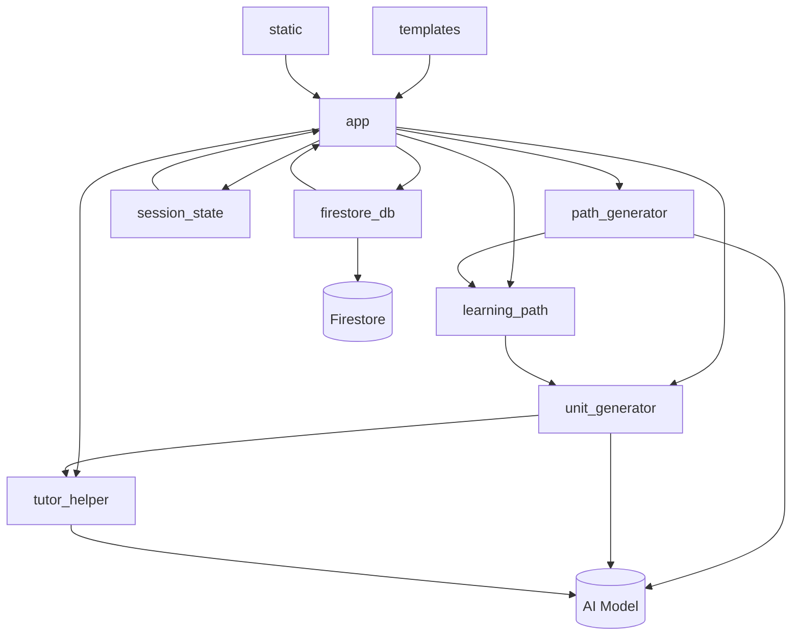
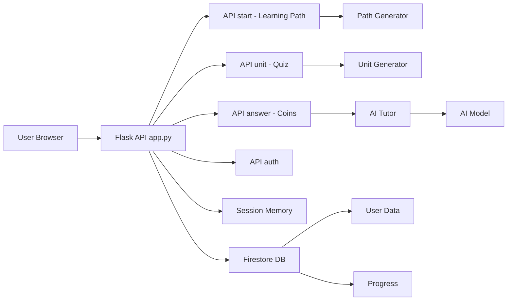

# Theorem
Theorem is an interactive and personalized learning application that teaches mathematics in a fun, engaging way.

## Deployment Link
To access the application, click this link: [www.theorem.com](https://paicteam1.onrender.com)

# App Structure

# Flow Chart app.py

