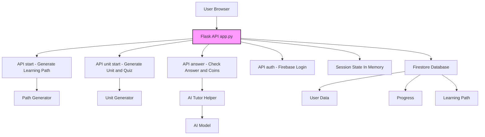

```mermaid
flowchart TD
    A[User Browser] --> B[Flask API app.py]

    B --> C[API start - Generate Learning Path]
    B --> D[API unit start - Generate Unit and Quiz]
    B --> E[API answer - Check Answer and Coins]
    B --> F[API auth - Firebase Login]

    C --> G[Path Generator]
    D --> H[Unit Generator]
    E --> I[AI Tutor Helper]

    B --> J[Session State In Memory]
    B --> K[Firestore Database]

    K --> L[User Data]
    K --> M[Progress]
    K --> N[Learning Path]

    I --> O[AI Model]

    style B fill:#f9f,stroke:#333,stroke-width:2px
```

# Deployment Link
https://paicteam1.onrender.com/
